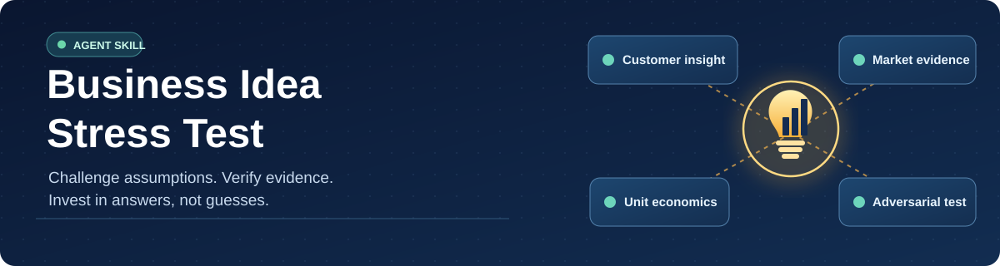

<div align="center">


# Business Idea Stress Test

**Don't fall in love with your business idea. Stress-test it.**

**Open-source AI business idea validator** for ChatGPT, Codex, Claude Code and other compatible agents. Interview the founder, investigate real demand and competitors, model unit economics, challenge risky assumptions, and design the cheapest meaningful test **before investing serious time or money**

[English](README.md) · [Русский](locales/README.ru.md) · [简体中文](locales/README.zh-CN.md) · [Español](locales/README.es.md) · [Deutsch](locales/README.de.md) · [Français](locales/README.fr.md) · [Português (Brasil)](locales/README.pt-BR.md) · [日本語](locales/README.ja.md)

[](https://github.com/alexeybarinov/business-idea-stress-test/releases/latest)
[](https://github.com/alexeybarinov/business-idea-stress-test/actions/workflows/validate.yml)
[](https://agentskills.io/specification)
[](LICENSE)
[](docs/faq.md)

[**Install**](#-install-in-your-ai-assistant) · [**Quick start**](docs/quickstart.md) · [**Worked showcase**](docs/showcase.md) · [**FAQ**](docs/faq.md) · [**Credits**](#-standing-on-the-shoulders-of-the-community) · [**Releases**](https://github.com/alexeybarinov/business-idea-stress-test/releases)

</div>



> [!IMPORTANT]
> **This is an evidence-first thinking workflow, not an autonomous board of directors or a prediction of business success.** When the host has no live research tools, the skill must clearly flag missing evidence. Seven credited projects *inspired* this independent implementation; their skill packages are **not bundled or automatically executed**.

## 🎯 Why this exists

Most business ideas sound convincing until someone asks the costly questions: **Does the buyer actually care? Who already solves this problem? What will acquisition and fulfillment cost? What's the weakest assumption? When should you stop?**

Business Idea Stress Test is designed for **one-off, pre-investment validation**, not recurring executive meetings or a promotional business plan. It interviews the founder, checks external evidence *when tools permit*, examines unit economics, and challenges the positive case before proposing a bounded real-world test.

| What the skill checks | What you get |
|---|---|
| Founder assumptions | A structured idea brief and high-impact unanswered questions |
| Core business hypothesis | Potential fatal blockers, realistic alternatives, falsifiable assumptions |
| Demand, buyers, competitors | Source-traceable market research and identified evidence gaps |
| Numbers and operations | Explicit financial scenarios, break-even conditions and cash exposure |
| The opposing case | Skeptical buyer, incumbent, financial and operational viewpoints |
| Decision conditions | A conditional assessment and a low-cost test with success/stop criteria |

## ⚡ Install in your AI assistant

**Use the method for your actual host.** One installation does not automatically carry across AI products. Full prerequisites, project-only setup, Windows/manual installation, updates and verification are in the **[multi-platform installation guide](docs/installation.md)**.

| Host | Quick installation / action |
|---|---|
| **ChatGPT** | [Download the latest skill-only ZIP](https://github.com/alexeybarinov/business-idea-stress-test/releases/latest) → **Plugins → Skills → Create → Upload from your computer**, if available |
| **Codex CLI / IDE** | `npx skills add alexeybarinov/business-idea-stress-test -g -a codex` |
| **Claude Code** | `npx skills add alexeybarinov/business-idea-stress-test -g -a claude-code` |
| **Claude.ai (web)** | Upload the [release ZIP](https://github.com/alexeybarinov/business-idea-stress-test/releases/latest) in **Customize → Skills** (eligible accounts) |
| **Gemini CLI** | `gemini skills install https://github.com/alexeybarinov/business-idea-stress-test.git` |
| **Cursor** | `npx skills add alexeybarinov/business-idea-stress-test -g -a cursor` |
| **GitHub Copilot** | `npx skills add alexeybarinov/business-idea-stress-test -g -a github-copilot` |
| **OpenCode / more** | `npx skills add alexeybarinov/business-idea-stress-test` → select your agent |

**Node.js / `npx` is only needed for the universal CLI installer**, not to run this instruction-only skill. ChatGPT/Claude.ai ZIP upload does not require it. The skill has **no paid API or runtime Python requirement**, but real market research depends on your host's available browsing tools and your provided evidence.

> [!NOTE]
> Compatibility is based on the open Agent Skills format and the linked host installation documentation. Our CI verifies the **bundle's structure**, not successful execution in every third-party AI client, subscription tier or tool configuration. See [compatibility caveats and troubleshooting](docs/faq.md).

**Try first, then install:** inspect the [SKILL.md](SKILL.md) and [stage-by-stage reference files](references/) before enabling any external skill.

## 🚀 Start your first session

Open a **new conversation for each unrelated idea**, explicitly select/invoke the installed skill, then paste:

```text
Use Business Idea Stress Test. Here's my business idea:
[Describe the product or service and the audience as you understand them.]

Start with the founder interview, one high-impact question at a time.
I don't have all the answers yet. Distinguish evidence from guesses.
Challenge my assumptions before I commit time or money.
```

| Host | Explicit invocation example |
|---|---|
| ChatGPT | Select `@Business Idea Stress Test` if the skill picker is available, or ask to use it by name |
| Codex | `$business-idea-stress-test Interview me about my idea` |
| Claude Code | `/business-idea-stress-test Challenge my idea` |
| Gemini, Cursor, Copilot, other hosts | Explicitly ask: `Use business-idea-stress-test. Start with the founder interview` |

Not sure what to provide? Say **“I don't know”**. The interview is designed to record that uncertainty instead of guessing. See the [full quick-start guide](docs/quickstart.md) and a [clearly fictional interview example](examples/example-session.md) and [illustrative report](examples/sample-output.md).

## 📖 See a worked demonstration

**[Explore the six-stage mobile bicycle repair showcase](docs/showcase.md)**: an explicitly simulated founder interview combined with **real, dated primary and competitor sources** from Portland, Oregon. Follow the evidence labels, competitor reality check, worked financial scenarios, red-team critique and bounded pilot. Simulated customer answers and costs are clearly distinguished from independently sourced facts; the showcase is **not** evidence that the example business would succeed

If you want a fast first look, open the [fictional conversation sample](examples/example-session.md), then the [full illustrative report](examples/sample-output.md). If you want to share the skill with others, see the [distribution guide](docs/distribution.md) and download the [GitHub social preview](assets/social-preview.jpg)

## 🔍 How the six-stage stress test works

```text
 YOUR IDEA
    │
    ▼
 ① FOUNDER INTERVIEW       Ask important questions one at a time
    │
    ▼
 ② EARLY VALIDATION       Challenge core assumptions and fatal blockers
    │
    ▼
 ③ EXTERNAL RESEARCH      Market + real buyers + direct/indirect competition
    │
    ▼
 ④ FINANCIAL REALITY      Unit economics + working capital + sensitivity
    │
    ▼
 ⑤ ADVERSARIAL REVIEW    Strongest counterargument + failure pre-mortem
    │
    ▼
 ⑥ CONDITIONAL DECISION  Evidence gaps + cheapest meaningful test + stop rules
```

**Adaptive by design.** If the founder cannot legally provide the service or cannot fulfill the core promise, that blocker is examined *before* extensive speculative research. The skill does not require ritual approval between stages but pauses for essential unanswered questions and user consent for real-world actions.

### Expected outputs

An idea brief, an evidence ledger, a dated competitor comparison, a transparent financial model, a risk register, the strongest defensible argument against the idea, and a **conditional** evaluation with low-cost experiments. Outputs are proportional to the available information, market and business model. A missing number stays missing.

## 🛡️ Built-in evidence and privacy safeguards

| Marker | Meaning |
|---|---|
| **F** | Verified external fact or correctly recorded founder input, with origin clearly distinguished |
| **E** | Dated external estimate, with source and method |
| **C** | Transparent calculation with displayed assumptions and inputs |
| **H** | Untested hypothesis requiring a real-world test |
| **U** | Unknown or unverified information |

The skill must not fabricate customer interviews, source URLs, market figures, competitor prices, measured CAC/LTV or claims of access to paid tools. Multiple viewpoints inside one AI are **not independent people or separately executed models**. Regulatory facts require appropriate current sources; high-stakes decisions may need human specialist review. Never submit confidential customer records, passwords or unnecessary sensitive details to an AI provider without assessing its data policy.

See [FAQ and limitations](docs/faq.md), [evidence handling](references/report.md) and [responsible reporting](SECURITY.md).

## 🧭 Documentation

| Guide | What's inside |
|---|---|
| [Multi-platform installation](docs/installation.md) | ChatGPT, Codex, Claude Code, Claude.ai, Gemini CLI, Cursor, Copilot, OpenCode, manual setup, update/remove |
| [Quick start](docs/quickstart.md) | First message, what to answer, reviewing sources and continuing later |
| [FAQ & troubleshooting](docs/faq.md) | Plan limitations, missing skill, research permissions, duplicate installs, privacy, version pinning |
| [Fictional example session](examples/example-session.md) | The skill's questioning style and treatment of unknowns |
| [Illustrative final output](examples/sample-output.md) | Evidence ledger, transparent hypothetical calculations, red-team critique and a conditional next step |
| [Stage references](references/) | Nine focused files read on demand, not dumped into every interaction |
| [Worked showcase with real public sources](docs/showcase.md) | Six-stage example: transparent source ledger, competitors, financial sensitivity and pilot design |
| [Discovery and directory kit](docs/distribution.md) | Truthful catalog description, install command, canonical links and directory checklist; no external posting |
| [Community and welcome post](docs/community.md) | What belongs in Issues versus Discussions, recommended categories and a draft welcome message |
| [Verification and maintenance](docs/maintenance.md) | Repeatable local checks, host smoke-test protocol and versioned release checklist |
| [Social Preview artwork](assets/social-preview.jpg) | 1280 × 640 repository-sharing image for the owner to upload via GitHub Settings |
| [Changelog](CHANGELOG.md) | Release history |
| [Contributing](CONTRIBUTING.md) | Corrections, localization updates and maintainer quality checks |

### Maintainer-friendly repository layout

```text
business-idea-stress-test/
├── SKILL.md                  # Agent Skills entry point (English)
├── agents/openai.yaml        # Optional OpenAI UI metadata and icon mapping
├── references/               # Focused methodology, loaded on demand
├── assets/                   # Logo, cover and small icon
├── docs/                     # Installation, quick start, FAQ
├── locales/                  # Seven translated README guides
├── examples/                 # Clearly marked fictional illustration
├── scripts/                  # Maintainer validation and ZIP packaging only
├── .github/workflows/        # Validation and versioned release automation
├── VERSION                   # SemVer source of truth
├── CHANGELOG.md
└── LICENSE
```

## 🤝 Community and project visibility

Found an unsupported claim, install issue, missing regulatory risk or inaccurate translation? [Open an issue](https://github.com/alexeybarinov/business-idea-stress-test/issues/new/choose). For open-ended Q&A and sanitized use-case stories, visit [Discussions](https://github.com/alexeybarinov/business-idea-stress-test/discussions) **after the repository owner enables it**. See [community guidance and the prepared welcome post](docs/community.md)

For directory maintainers and people sharing this skill, the [distribution kit](docs/distribution.md) provides a reusable, accuracy-checked summary and install link. No installations, directory placements or endorsements are asserted without independent confirmation

## ❤️ Standing on the shoulders of the community

Huge thanks to the creators who published the ideas that inspired this **independently written** workflow:

| Inspiration | Author/project | Contribution that inspired us |
|---|---|---|
| [Grilling](https://github.com/mattpocock/skills/blob/main/skills/productivity/grilling/SKILL.md) | **Matt Pocock** | High-impact, sequential founder questioning |
| [Idea Validator](https://github.com/BuildGreatProducts/builder-os/blob/main/skills/idea-validator/SKILL.md) | **BuildGreatProducts** | Stress-testing assumptions and critical blockers early |
| [Market Researcher](https://github.com/xcrrr/claude-skills/blob/main/skills/business/market-researcher/SKILL.md) | **xcrrr** | Geographically relevant market analysis and sizing discipline |
| [Customer Research](https://github.com/coreyhaines31/marketingskills/blob/main/skills/customer-research/SKILL.md) | **Corey Haines** | Buyer insight grounded in observable evidence |
| [Competitor Profiling](https://github.com/coreyhaines31/marketingskills/blob/main/skills/competitor-profiling/SKILL.md) | **Corey Haines** | Structured competitor research and comparison |
| [Startup Analyst](https://github.com/sickn33/agentic-awesome-skills/blob/main/skills/startup-analyst/SKILL.md) | **sickn33** | Early-stage financial and operational scrutiny |
| [Devil's Advocate](https://github.com/jukeyman/jukeyman-skills/blob/main/skills/productivity--pm-ai-partner--devil-advocate/SKILL.md) | **jukeyman** | Strongest-counterargument and pre-mortem thinking |

This is **not** an official adaptation, partnership or endorsement. We do not package their original skill files or scripts. Each original project keeps its own license. See [full credits and limitations](references/sources.md).

## 📦 Versioning, contributing and license

Releases use [Semantic Versioning](https://semver.org/): patch versions for compatible fixes, minor versions for new backward-compatible features or substantial distribution additions, and major versions for breaking workflow changes. A new `VERSION` on `main` triggers the release workflow, which creates a new Git tag, GitHub Release and installable ZIP (subject to GitHub Actions permissions). Existing tags are never overwritten.

- [Latest release and versioned ZIP](https://github.com/alexeybarinov/business-idea-stress-test/releases/latest)
- [What changed](CHANGELOG.md)
- [Suggest a feature, correction or translation improvement](https://github.com/alexeybarinov/business-idea-stress-test/issues)
- [Contributor guide](CONTRIBUTING.md) · [Security guidance](SECURITY.md)

**License:** [MIT](LICENSE) for original files in this repository. Third-party linked works retain their respective licenses
